# Chapter 3

### Exercise 3.1
Devise three example tasks of your own that fit into the MDP framework,
identifying for each its states, actions, and rewards. Make the three examples as different
from each other as possible. The framework is abstract and flexible and can be applied in
many different ways. Stretch its limits in some way in at least one of your examples.
#### Answer 
1. **Chess AI**  
  Algorithm can learn which is the next best move to play to maximize reward which is +1 for a win, 0 for a draw, -1 for a lose.  
  State is combined from every piece position.
2. **Automatic traffic lights coordinator**  
  Reward could be number of cars staying in front of traffic lights.  
  State is number of cars staying in front of each traffic light separately.  
  Action is increasing or decreasing green light time in each of traffic light.
3. **Stock prediction**  
  Reward (cost) is MAE (mean absolute error) between predicted and real stock price.  
  State is a history of stock price for some time (ex. 2 months to the past).  
  Action can be increase/decrease predicted stock price.

### Exercise 3.2
Is the MDP framework adequate to usefully represent all goal-directed
learning tasks? Can you think of any clear exceptions?
#### Answer
One exception I can think about is model with infinite states space.

### Exercise 3.3
Consider the problem of driving. You could define the actions in terms of
the accelerator, steering wheel, and brake, that is, where your body meets the machine.
Or you could define them farther out—say, where the rubber meets the road, considering
your actions to be tire torques. Or you could define them farther in—say, where your
brain meets your body, the actions being muscle twitches to control your limbs. Or you
could go to a really high level and say that your actions are your choices of where to drive.
What is the right level, the right place to draw the line between agent and environment?
On what basis is one location of the line to be preferred over another? Is there any
fundamental reason for preferring one location over another, or is it a free choice?
#### Answer
Choice where the agent has the most control over state through his action seems to be the most accurate.

### Exercise 3.4
Give a table analogous to that in Example 3.3, but for p(s0, r|s, a). It should have columns for s, a, s0, r, and p(s0, r|s, a), and a row for every 4-tuple for which p(s0, r|s, a) > 0.


#### Answer 


### Exercise 3.5
The equations in Section 3.1 are for the continuing case and need to be
modified (very slightly) to apply to episodic tasks. Show that you know the modifications
needed by giving the modified version of equation (3.3).


#### Answer
For episodic tasks we should get next state not from set of nonterminal states but from set of all states.


### Exercise 3.6
Suppose you treated pole-balancing as an episodic task but also used
discounting, with all rewards zero except for -1 upon failure. What then would the
return be at each time? How does this return differ from that in the discounted, continuing
formulation of this task?

#### Answer
For a episodic discounted task return would be -γ^{T-1} where T is number of steps in each episode

### Exercise 3.7
Imagine that you are designing a robot to run a maze. You decide to give it a
reward of +1 for escaping from the maze and a reward of zero at all other times. The task
seems to break down naturally into episodes—the successive runs through the maze—so
you decide to treat it as an episodic task, where the goal is to maximize expected total
reward (3.7). After running the learning agent for a while, you find that it is showing
no improvement in escaping from the maze. What is going wrong? Have you effectively
communicated to the agent what you want it to achieve?

#### Answer 
There is no discounting so the reward is the same, no matter how quickly agent escape from a maze.
For the agent there is no difference between quick and long escape.

### Exercise 3.8
Suppose γ = 0.5 and the following sequence of rewards is received R1 = 1, R2 = 2, R3 = 6, R4 = 3, and R5 = 2, with T = 5. What are G0, G1, ..., G5? *Hint: Work backwards.*

#### Answer
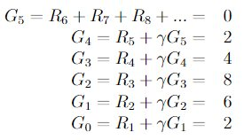

### Exercise 3.9
Suppose γ = 0.9 and the reward sequence is R1 = 2 followed by an infinite
sequence of 7s. What are G1 and G0?

#### Answer


### Exercise 3.10
Prove the second equality in (3.10).


#### Answer

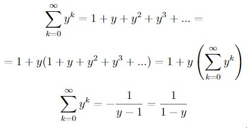

*latex:*
```
\sum_{k=0}^{\infty} y^k = 1 + y + y^2 + y^3 + ... =     
= 1 + y(1 + y + y^2 + y^3 + ...) = 1 + y\left(\sum_{k=0}^{\infty} y^k\right)    
\sum_{k=0}^{\infty} y^k = - \frac{1}{y-1} = \frac{1}{1-y}   
```

### Exercise 3.11
If the current state is St, and actions are selected according to stochastic
policy π, then what is the expectation of Rt+1 in terms of π and the four-argument
function p (3.2)?

#### Answer

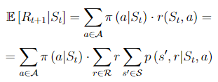

*latext:*

```
\mathbb{E}\left[R_{t+1} \middle|S_{t}\right] = \sum_{a \in \mathcal{A}} \pi\left(a \middle| S_t\right) \cdot r(S_t, a) =
= \sum_{a \in \mathcal{A}} \pi\left(a \middle| S_t\right) \cdot \sum_{r \in \mathcal{R}} r \sum_{s' \in \mathcal{S}} p\left(s', r \middle| S_t, a\right)
```
### Exercise 3.12
Give an equation for vπ in terms of qπ and π.

#### Answer


### Exercise 3.13
Give an equation for qπ in terms of vπ and the four-argument p.

#### Answer


### Exercise 3.14
The Bellman equation (3.14) must hold for each state for the value function
vπ shown in Figure 3.2 (right) of Example 3.5. Show numerically that this equation holds
for the center state, valued at +0.7, with respect to its four neighboring states, valued at
+2.3, +0.4, -0.4, and +0.7. (These numbers are accurate only to one decimal place.)

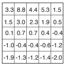

#### Answer

0.25 * (0 + 0.9 * 2.3) + 0.25 * (0 + 0.9 * 0,4) + 0.25 * (0 - 0.9 * 0.4) + 0.25 * (0 + 0.9 * 0.7) = 

= 0.5175 + 0.09 - 0.09 + 0.1575 = 0.675 ≅ 0.7

### Exercise 3.15

In the gridworld example, rewards are positive for goals, negative for
running into the edge of the world, and zero the rest of the time. Are the signs of these
rewards important, or only the intervals between them? Prove, using (3.8), that adding a
constant c to all the rewards adds a constant, vc, to the values of all states, and thus
does not affect the relative values of any states under any policies. What is vc in terms
of c and γ?

#### Answer

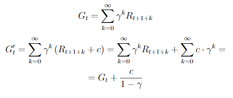

*latex:*

```
G_t = \sum_{k=0}^{\infty} \gamma^k R_{t+1+k}    
G'_t = \sum_{k=0}^{\infty} \gamma^k \left(R_{t+1+k} + c\right) = \sum_{k=0}^{\infty} \gamma^k R_{t+1+k} + \sum_{k=0}^{\infty} c\cdot \gamma^k = 
= G_t + \frac{c}{1 - \gamma}
```
### Exercise 3.16

Now consider adding a constant c to all the rewards in an episodic task,
such as maze running. Would this have any effect, or would it leave the task unchanged
as in the continuing task above? Why or why not? Give an example.

#### Answer
For episodic task the sum doesn't go to infinity so te equation above is no longer true. 
Have a look for maze  runner task which can be finished in one step. Each step has reward -1 and terminal state has reward of 1.
If we add 10 to every reward then longer path can cause higher reward. Without adding constant 10 to all rewards the shortest path is the best.

### Exercise 3.17

What is the Bellman equation for action values, that
is, for qπ? It must give the action value qπ(s, a) in terms of the action
values, qπ(s', a'), of possible successors to the state–action pair (s, a).
Hint: the backup diagram to the right corresponds to this equation.
Show the sequence of equations analogous to (3.14), but for action
values.

#### Answer


### Exercise 3.18
The value of a state depends on the values of the actions possible in that
state and on how likely each action is to be taken under the current policy. We can
think of this in terms of a small backup diagram rooted at the state and considering each
possible action:


Give the equation corresponding to this intuition and diagram for the value at the root
node, vπ(s), in terms of the value at the expected leaf node, qπ(s, a), given St = s. This
equation should include an expectation conditioned on following the policy, π. Then give
a second equation in which the expected value is written out explicitly in terms of π(a|s)
such that no expected value notation appears in the equation.

#### Answer


_latex:_

```
    v_{\pi}(s) = 
    \mathbb{E}_{\pi}\left[q_{\pi}\left(s, a_1\right)\right] + 
    \mathbb{E}_{\pi}\left[q_{\pi}\left(s, a_2\right)\right] + 
    \mathbb{E}_{\pi}\left[q_{\pi}\left(s, a_3\right)\right]
    
    v_{\pi}(s) = 
    \pi\left(a_1 \middle| s\right) \cdot q_{\pi}\left(s, a_1\right) + 
    \pi\left(a_2 \middle| s\right) \cdot q_{\pi}\left(s, a_2\right) + 
    \pi\left(a_3 \middle| s\right) \cdot q_{\pi}\left(s, a_3\right)
```

### Exercise 3.19
The value of an action, qπ(s, a), depends on the expected next reward and
the expected sum of the remaining rewards. Again we can think of this in terms of a
small backup diagram, this one rooted at an action (state–action pair) and branching to
the possible next states:


Give the equation corresponding to this intuition and diagram for the action value,
qπ(s, a), in terms of the expected next reward, Rt+1, and the expected next state value,
vπ(St+1), given that St =s and At =a. This equation should include an expectation but
not one conditioned on following the policy. Then give a second equation, writing out the
expected value explicitly in terms of p(s0, r|s, a) defined by (3.2), such that no expected
value notation appears in the equation.

#### Answer

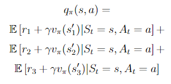

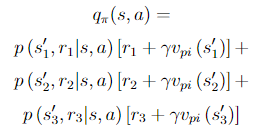

_latex:_

```
    q_{\pi}(s,a) = 
    \mathbb{E}\left[r_1 + \gamma v_{\pi}(s'_1) \middle| S_t = s, A_t = a\right] + 
    \mathbb{E}\left[r_2 + \gamma v_{\pi}(s'_2) \middle| S_t = s, A_t = a\right] +
    \mathbb{E}\left[r_3 + \gamma v_{\pi}(s'_3) \middle| S_t = s, A_t = a\right] 
    
    q_{\pi}(s,a) = 
    p\left(s'_1, r_1 \middle| s, a\right)\left[r_1 + \gamma v_{pi}\left(s'_1\right)\right] +
    p\left(s'_2, r_2 \middle| s, a\right)\left[r_2 + \gamma v_{pi}\left(s'_2\right)\right] +
    p\left(s'_3, r_3 \middle| s, a\right)\left[r_3 + \gamma v_{pi}\left(s'_3\right)\right]
```    

### Exercise 3.20
Draw or describe the optimal state-value function for the golf example.

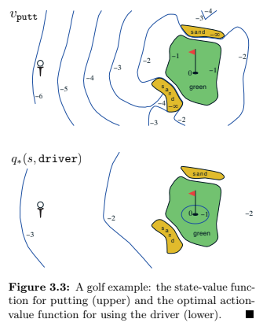

#### Answer
We should use driver to get to the green field and then choose to use putter to finish in one put.

### Exercise 3.21
Draw or describe the contours of the optimal action-value function for putting, q*(s, putter), for the golf example.

#### Answer
The optimal action-value function is the same as state value for putter.

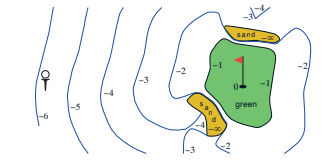

### Exercise 3.22
Consider the continuing MDP shown on to the
right. The only decision to be made is that in the top state,
where two actions are available, left and right. The numbers
show the rewards that are received deterministically after
each action. There are exactly two deterministic policies,
π_left and π_right. What policy is optimal if γ = 0? If γ = 0.9? If γ = 0.5?

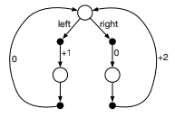

#### Answer

For γ = 0.9 optimal is π_right policy.

For γ = 0.5 both policies are equal.

For γ = 0.0 optimal is π_left policy.

### Exercise 3.23

Give the Bellman equation for q* for the recycling robot.

#### Answer

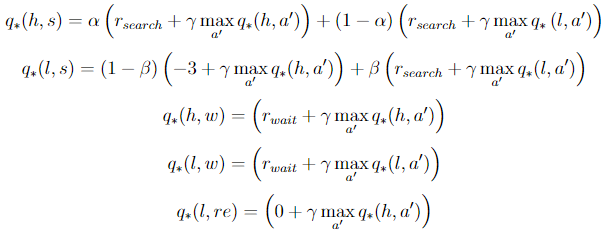

_latex:_

```
    q_{*}(h,s) = \alpha \left( r_{search} + \gamma \max_{a'}q_{*}(h,a')\right) + \left(1 - \alpha\right) \left(r_{search} + \gamma \max_{a'}q_{*}\left(l, a'\right)\right)
    q_{*}(l,s) = \left(1-\beta\right)\left(-3 + \gamma \max_{a'}q_{*}(h,a')\right) + \beta\left(r_{search} + \gamma \max_{a'}q_{*}(l,a')\right)
    q_{*}(h,w) = \left(r_{wait} + \gamma \max_{a'}q_{*}(h,a')\right)
    q_{*}(l,w) = \left(r_{wait} + \gamma \max_{a'}q_{*}(l,a')\right)
    q_{*}(l,re) = \left(0 + \gamma \max_{a'}q_{*}(h,a')\right)
```

### Exercise 3.24

Figure 3.5 gives the optimal value of the best state of the gridworld as
24.4, to one decimal place. Use your knowledge of the optimal policy and (3.8) to express
this value symbolically, and then to compute it to three decimal places.

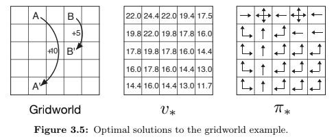

#### Answer


