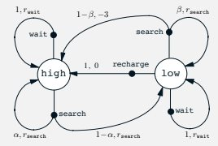
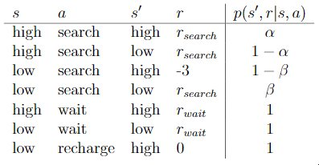

# Chapter 3

### Exercise 3.1
Devise three example tasks of your own that fit into the MDP framework,
identifying for each its states, actions, and rewards. Make the three examples as different
from each other as possible. The framework is abstract and flexible and can be applied in
many different ways. Stretch its limits in some way in at least one of your examples.
#### Answer 
1. **Chess AI**  
  Algorithm can learn which is the next best move to play to maximize reward which is +1 for a win, 0 for a draw, -1 for a lose.  
  State is combined from every piece position.
2. **Automatic traffic lights coordinator**  
  Reward could be number of cars staying in front of traffic lights.  
  State is number of cars staying in front of each traffic light separately.  
  Action is increasing or decreasing green light time in each of traffic light.
3. **Stock prediction**  
  Reward (cost) is MAE (mean absolute error) between predicted and real stock price.  
  State is a history of stock price for some time (ex. 2 months to the past).  
  Action can be increase/decrease predicted stock price.

### Exercise 3.2
Is the MDP framework adequate to usefully represent all goal-directed
learning tasks? Can you think of any clear exceptions?
#### Answer
One exception I can think about is model with infinite states space.

### Exercise 3.3
Consider the problem of driving. You could define the actions in terms of
the accelerator, steering wheel, and brake, that is, where your body meets the machine.
Or you could define them farther out—say, where the rubber meets the road, considering
your actions to be tire torques. Or you could define them farther in—say, where your
brain meets your body, the actions being muscle twitches to control your limbs. Or you
could go to a really high level and say that your actions are your choices of where to drive.
What is the right level, the right place to draw the line between agent and environment?
On what basis is one location of the line to be preferred over another? Is there any
fundamental reason for preferring one location over another, or is it a free choice?
#### Answer
Choice where the agent has the most control over state through his action seems to be the most accurate.

### Exercise 3.4
Give a table analogous to that in Example 3.3, but for p(s0, r|s, a). It should have columns for s, a, s0, r, and p(s0, r|s, a), and a row for every 4-tuple for which p(s0, r|s, a) > 0.

#### Answer 

