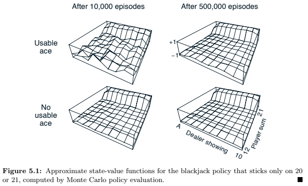

# Chapter 5

### Exercise 5.1

Consider the diagrams on the right in Figure 5.1. Why does the estimated
value function jump up for the last two rows in the rear? Why does it drop off for the
whole last row on the left? Why are the frontmost values higher in the upper diagrams
than in the lower?



#### Answer

The last two rows are for players 20 and 21. Thats the only two states player sticks to. There is a lot of chances that player gets bust when he has 18 or 19 nad getting one more card.
If player has 17 or less dealer needs to gets bust to let player wins.

Last row on the left means dealer has an ace so there is one more chance for dealer to count ace as 1 not as 11.

With usable ace on players hand there is one more chance for player to count ace as 1 not as 11 so there is less probability to gets bust by the player.

### Exercise 5.2

Suppose every-visit MC was used instead of first-visit MC on the blackjack task. Would you expect the results to be very different? Why or why not?

#### Answer

Visiting one state more than once within one episode is possible only by switching ace from 11 to 1. It is not very likely to happen so using every-visit MC shouldn't change result significantly.

### Exercise 5.3

What is the backup diagram for Monte Carlo estimation of qπ?

#### Answer

Backup diagram is the same as for estimating vπ but it starts in action element (black circle).

### Exercise 5.4

The pseudocode for Monte Carlo ES is ineffcient because, for each state–action pair, it maintains a list of all returns and repeatedly calculates their mean. It would be more effcient to use techniques similar to those explained in Section 2.4 to maintain
just the mean and a count (for each state–action pair) and update them incrementally.
Describe how the pseudocode would be altered to achieve this.

#### Answer

We can get average from all returns just keeping number of returns and last average. 
```
Qty(s,a)++
Q(s,a) = (Q(s,a)+Rt) * (Qty(s,a) - 1) / Qty(s,a)
```
