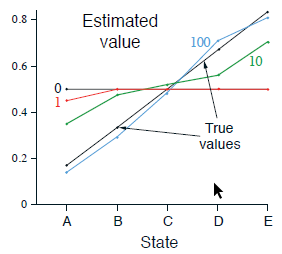
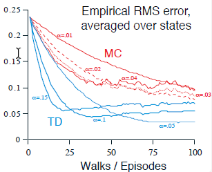

# Chapter 6

### Exercise 6.1

If V changes during the episode, then (6.6) only holds approximately; what would the difference be between the two sides? 
Let Vt denote the array of state values used at time t in the TD error (6.5) and in the TD update (6.2). 
Redo the derivation above to determine the additional amount that must be added to the sum of TD errors in order to equal the Monte Carlo error.

#### Answer

### Exercise 6.2

This is an exercise to help develop your intuition about why TD methods
are often more efficient than Monte Carlo methods. Consider the driving home example
and how it is addressed by TD and Monte Carlo methods. Can you imagine a scenario
in which a TD update would be better on average than a Monte Carlo update? Give
an example scenario — a description of past experience and a current state — in which
you would expect the TD update to be better. 

Here’s a hint: Suppose you have lots of experience driving home from work. Then you move to a new building and a new parking
lot (but you still enter the highway at the same place). Now you are starting to learn
predictions for the new building. Can you see why TD updates are likely to be much
better, at least initially, in this case? Might the same sort of thing happen in the original
scenario?

#### Answer

MC method needs to build prediction from whole episode and result is probably different than original one. TD method can use predictions from highway entrance to home from previous experience.

In original scenario this could happen the same when some part of episode is quite unstable and the other part is rather stable during episodes (ex. time for city part of road is very different depends on weather, week day, constructions and time for highway part of road is likely the same between episodes). 

### Exercise 6.3

From the results shown in the left graph of the random walk example it
appears that the first episode results in a change in only V(A). What does this tell you
about what happened on the first episode? Why was only the estimate for this one state
changed? By exactly how much was it changed?

#### Answer

First episode ended in left terminal state (reward = 0) because V(A) lowered.

α = 0.1 and γ = 1 for this example and starting estimates are 0.5 for each state.

V(A) = V(A) + α(R + V(T) - V(A)) = 0.5 + 0.1(0 + 0 - 0.5) = 0.45

Value of state A lowered of 0.05.

Assume the episode was shortest possible (C,0,B,0,A,0,Tleft).
V(C) and V(B) are the same after that episode because

V(C) = V(C) + α(R + V(B) - V(C)) = 0.5 + 0.1(0 + 0.5 - 0.5) = 0.5
_same for state B_

Episode can takes more steps than the shortest one and visits every states but Tright (even multiple times during first episode).

### Exercise 6.4

The specific results shown in the right graph of the random walk example
are dependent on the value of the step-size parameter, α. Do you think the conclusions
about which algorithm is better would be affected if a wider range of α values were used?
Is there a different, fixed value of α at which either algorithm would have performed
significantly better than shown? Why or why not?

#### Answer 

Wider range of parameter α ∊ (0, 1] wouldn't affect results.

Higher values of α perform better at the begining but have greater error after some episodes than lower values of α parameter.

### Exercise 6.5

In the right graph of the random walk example, the RMS error of the
TD method seems to go down and then up again, particularly at high α’s. What could
have caused this? Do you think this always occurs, or might it be a function of how the
approximate value function was initialized?

#### Answer

Initially every state-value is 0.5 and that's correct value on average. When some of state-values are corrected then RMS can be lower and after few more episodes, when other state-values are calculated on algorithm basis, RMS can be higher.

If initial state-values are choosen far from true value it shouldn't occured (but probably it takes longer algorithm to converge).

### Exercise 6.6

In Example 6.2 we stated that the true values for the random walk example
are 1/6, 2/6, 3/6, 4/6 and 5/6, for states A through E. Describe at least two different ways that
these could have been computed. Which would you guess we actually used? Why?

#### Answer

This can be done by using value iteration which converges to the result. Model for this example is easy to implement so this method is quite possible.

Another way is to start from V(C) which has to be 0.5.

To calculate every state-values use equations:

V(D) = 0.5 * (V(C) + V(E)) = 0.25 + 0.5 * V(E)

V(E) = 0.5 * (V(D) + 1) = 0.5 * (0.25 + V(E) + 1) -> V(E) = 5/6 & V(D) = 4/6

V(B) = 0.5 * (V(A) + V(C)) = 0.5 * V(A) + 0.25

V(A) = 0.5 * (0 + V(B)) = 0.5 * (0.5 * V(A) + 0.25) -> V(A) = 1/6 & V(B) = 2/6
