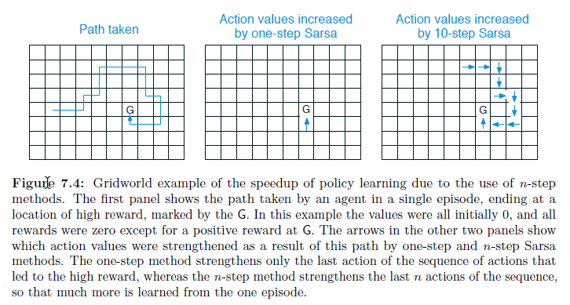
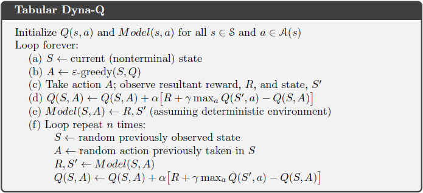
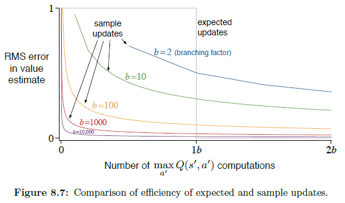
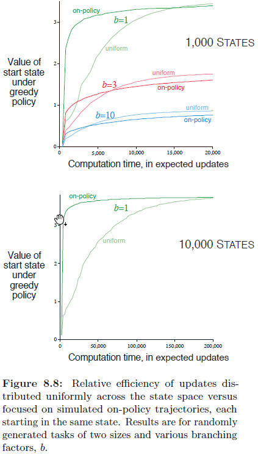

# Chapter 8

### Exercise 8.1

The nonplanning method looks particularly poor in Figure 8.3 because it is
a one-step method; a method using multi-step bootstrapping would do better. Do you
think one of the multi-step bootstrapping methods from Chapter 7 could do as well as
the Dyna method? Explain why or why not.

#### Answer

n-step TD with n high enough to cover optimal path from starting point to terminate state.

More intuition from Figure 7.4:

### Exercise 8.2

Why did the Dyna agent with exploration bonus, Dyna-Q+, perform
better in the first phase as well as in the second phase of the blocking and shortcut
experiments?

#### Answer

Dyna-Q is less explorative and after first time it found way to get into terminal state it sticks to it for a longer time.

### Exercise 8.3

Careful inspection of Figure 8.5 reveals that the difference between Dyna-Q+
and Dyna-Q narrowed slightly over the first part of the experiment. What is the reason
for this?

#### Answer 

Dyna-Q+ finds more efficient patch much faster but after some time Dyna-Q finds it too. Exploration cost for Dyna-Q+ is bigger than for Dyna-Q and that's the reason.

### Exercise 8.5

1. How might the tabular Dyna-Q algorithm shown on page 164 be modified
to handle stochastic environments? 
2. How might this modification perform poorly on
changing environments such as considered in this section? 
3. How could the algorithm be
modified to handle stochastic environments and changing environments?

#### Answer

1. We should add R and S' in step _(e)_ as next element in array (like _Model(S,A)[] ← R,S'_), then in step 4 of _(f)_ loop we can randomly select next R and S' from array
2. The reason can be exactly the same as in Example 8.3: Shortcut Maze
3. We can add exploration bonus (Dyna-Q+ for env changing into better conditions) and we can add tracking of changes in Q(S,A); when change is "large" and negative we can zeroing at all

### Exercise 8.6

The analysis above assumed that all of the b possible next states were
equally likely to occur. Suppose instead that the distribution was highly skewed, that
some of the b states were much more likely to occur than most. Would this strengthen or
weaken the case for sample updates over expected updates? Support your answer.

#### Answer

Sample updates in environment with highly skewed distribution over states probabilities would be closer to what we see for lower values of b because there are less "meaningfull" states.

### Exercise 8.7

Some of the graphs in Figure 8.8 seem to be scalloped in their early portions,
particularly the upper graph for b = 1 and the uniform distribution. Why do you think
this is? What aspects of the data shown support your hypothesis?

#### Answer 

Scalloped comes from rewards distribution. On each episode uniform algorithm need to take into consideration poor state-action values which doesn't make policy improvement (more horizontal parts of line).
